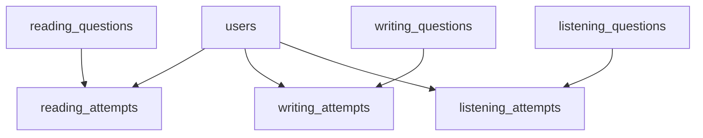

# Multi-section Schema and API Design for PTE Academic

This document designs database schemas, migrations, APIs, and seed formats for Reading, Writing, and Listening sections, aligned with the Speaking implementation analyzed in [speaking-implementation-analysis.md](docs/architecture/speaking-implementation-analysis.md:1) and the existing DB patterns in [lib/db/schema.ts](lib/db/schema.ts:382).

Assumptions and goals:

- Follow dedicated per-section tables with Postgres enums, JSONB for flexible fields, indexing, and FK cascades (mirroring [schema.speakingQuestions](lib/db/schema.ts:382) and [schema.speakingAttempts](lib/db/schema.ts:398)).
- Keep parity with Speaking APIs and validation patterns in [app/api/speaking/schemas.ts](app/api/speaking/schemas.ts:1), [app/api/speaking/questions/route.ts](app/api/speaking/questions/route.ts:1), [app/api/speaking/attempts/route.ts](app/api/speaking/attempts/route.ts:1).
- Provide options for immediate algorithmic scoring and AI scoring; implementation can choose per endpoint or via feature flags.

1. Complete Schema Definitions

1.1 Enums

Define new enums to mirror section question types. Names match conventions like [schema.speakingTypeEnum](lib/db/schema.ts:17) and [schema.difficultyEnum](lib/db/schema.ts:27).

SQL-like

```sql
-- Reading question types
CREATE TYPE reading_type AS ENUM (
  'mcq_single',
  'mcq_multiple',
  'fib',                -- Reading Fill in the Blanks
  'reorder_paragraphs',
  'rw_fib'              -- Reading & Writing Fill in the Blanks
);

-- Writing question types
CREATE TYPE writing_type AS ENUM (
  'summarize_written_text',
  'write_essay'
);

-- Listening question types
CREATE TYPE listening_type AS ENUM (
  'summarize_spoken_text',
  'mcq_single',
  'mcq_multiple',
  'fib',
  'highlight_correct_summary',
  'select_missing_word',
  'highlight_incorrect_words',
  'write_from_dictation'
);
```

1.2 Questions Tables

Existing tables (already in code):

- [schema.readingQuestions](lib/db/schema.ts:416)
- [schema.writingQuestions](lib/db/schema.ts:432)

New: listeningQuestions

SQL-like

```sql
CREATE TABLE listening_questions (
  id uuid PRIMARY KEY DEFAULT gen_random_uuid(),
  type listening_type NOT NULL,
  title text NOT NULL,
  audio_url text NOT NULL,
  transcript text,
  options jsonb,        -- for MCQ options, summaries list, etc
  answer_key jsonb,     -- ground truth for scoring where applicable
  difficulty difficulty_level NOT NULL DEFAULT 'Medium',
  tags jsonb DEFAULT '[]'::jsonb,
  is_active boolean NOT NULL DEFAULT true,
  created_at timestamp NOT NULL DEFAULT now()
);
CREATE INDEX idx_listening_questions_type ON listening_questions(type);
CREATE INDEX idx_listening_questions_is_active ON listening_questions(is_active);
CREATE INDEX idx_listening_questions_tags_gin ON listening_questions USING gin(tags);
```

Notes:

- audio_url required for all listening types.
- transcript is optional for reference or scoring.

  1.3 Attempts Tables

Reading Attempts (reading_attempts)

SQL-like

```sql
CREATE TABLE reading_attempts (
  id uuid PRIMARY KEY DEFAULT gen_random_uuid(),
  user_id text NOT NULL REFERENCES users(id) ON DELETE CASCADE,
  question_id uuid NOT NULL REFERENCES reading_questions(id) ON DELETE CASCADE,
  type reading_type NOT NULL,
  user_response jsonb NOT NULL DEFAULT '{}'::jsonb,  -- selectedOptions, filledBlanks, reorderedParagraphs, text if needed
  scores jsonb NOT NULL DEFAULT '{}'::jsonb,         -- accuracyPct, perBlank, perItem, rubric if any
  time_taken_ms integer,                             -- duration user spent
  timings jsonb,                                     -- optional client timings
  created_at timestamp NOT NULL DEFAULT now()
);
CREATE INDEX idx_reading_attempts_question ON reading_attempts(question_id);
CREATE INDEX idx_reading_attempts_user_type ON reading_attempts(user_id, type);
```

Writing Attempts (writing_attempts)

SQL-like

```sql
CREATE TABLE writing_attempts (
  id uuid PRIMARY KEY DEFAULT gen_random_uuid(),
  user_id text NOT NULL REFERENCES users(id) ON DELETE CASCADE,
  question_id uuid NOT NULL REFERENCES writing_questions(id) ON DELETE CASCADE,
  type writing_type NOT NULL,
  text_answer text NOT NULL,                         -- essay or one-sentence summary
  word_count integer,
  scores jsonb NOT NULL DEFAULT '{}'::jsonb,         -- grammar, vocabulary, coherence, taskResponse, spelling, total, rubric, feedback, meta
  time_taken_ms integer,
  timings jsonb,
  created_at timestamp NOT NULL DEFAULT now()
);
CREATE INDEX idx_writing_attempts_question ON writing_attempts(question_id);
CREATE INDEX idx_writing_attempts_user_type ON writing_attempts(user_id, type);
```

Listening Attempts (listening_attempts)

SQL-like

```sql
CREATE TABLE listening_attempts (
  id uuid PRIMARY KEY DEFAULT gen_random_uuid(),
  user_id text NOT NULL REFERENCES users(id) ON DELETE CASCADE,
  question_id uuid NOT NULL REFERENCES listening_questions(id) ON DELETE CASCADE,
  type listening_type NOT NULL,
  text_answer text,                                  -- for summarize_spoken_text or dictation
  user_response jsonb NOT NULL DEFAULT '{}'::jsonb,  -- selectedOption(s), filledBlanks, highlightedWords
  scores jsonb NOT NULL DEFAULT '{}'::jsonb,         -- per-type scoring + total
  time_taken_ms integer,
  timings jsonb,
  created_at timestamp NOT NULL DEFAULT now()
);
CREATE INDEX idx_listening_attempts_question ON listening_attempts(question_id);
CREATE INDEX idx_listening_attempts_user_type ON listening_attempts(user_id, type);
```

1.4 Field Specifications

Common across attempts:

- user_response JSONB structure for flexibility:
  - Reading:
    - mcq_single: { selectedOption: string }
    - mcq_multiple: { selectedOptions: string[] }
    - fib: { blanks: [{ index: number, answer: string }] }
    - rw_fib: { blanks: [{ index: number, answer: string }] }
    - reorder_paragraphs: { order: number[] } or { ordered: string[] }
  - Writing:
    - text_answer: TEXT, word_count: integer
  - Listening:
    - summarize_spoken_text: text_answer
    - write_from_dictation: text_answer
    - mcq_single: { selectedOption: string }
    - mcq_multiple: { selectedOptions: string[] }
    - fib: { blanks: [{ index: number, answer: string }] }
    - highlight_correct_summary: { selectedOption: string }
    - select_missing_word: { selectedOption: string }
    - highlight_incorrect_words: { indices: number[] } or { words: string[] }

scores JSONB suggested keys:

- Common: { total: number, rubric?: object, feedback?: string, meta?: object }
- Reading: { accuracyPct: number, perItem?: object }
- Writing: { grammar, vocabulary, spelling, coherence, taskResponse, total }
- Listening: per-type fields, e.g., { accuracyPct } or AI rubric for summaries

  1.5 Relationships Diagram



2. Migration Specification

Ordered steps:

1. Create enums: reading_type, writing_type, listening_type.
2. Create listening_questions table with indexes.
3. Create reading_attempts, writing_attempts, listening_attempts tables with indexes and FKs.

SQL-like pseudocode

```sql
-- 1. Enums
CREATE TYPE reading_type AS ENUM ('mcq_single','mcq_multiple','fib','reorder_paragraphs','rw_fib');
CREATE TYPE writing_type AS ENUM ('summarize_written_text','write_essay');
CREATE TYPE listening_type AS ENUM ('summarize_spoken_text','mcq_single','mcq_multiple','fib','highlight_correct_summary','select_missing_word','highlight_incorrect_words','write_from_dictation');

-- 2. listening_questions
CREATE TABLE listening_questions (
  id uuid PRIMARY KEY DEFAULT gen_random_uuid(),
  type listening_type NOT NULL,
  title text NOT NULL,
  audio_url text NOT NULL,
  transcript text,
  options jsonb,
  answer_key jsonb,
  difficulty difficulty_level NOT NULL DEFAULT 'Medium',
  tags jsonb DEFAULT '[]'::jsonb,
  is_active boolean NOT NULL DEFAULT true,
  created_at timestamp NOT NULL DEFAULT now()
);
CREATE INDEX idx_listening_questions_type ON listening_questions(type);
CREATE INDEX idx_listening_questions_is_active ON listening_questions(is_active);
CREATE INDEX idx_listening_questions_tags_gin ON listening_questions USING gin(tags);

-- 3. Attempts tables
CREATE TABLE reading_attempts (
  id uuid PRIMARY KEY DEFAULT gen_random_uuid(),
  user_id text NOT NULL REFERENCES users(id) ON DELETE CASCADE,
  question_id uuid NOT NULL REFERENCES reading_questions(id) ON DELETE CASCADE,
  type reading_type NOT NULL,
  user_response jsonb NOT NULL DEFAULT '{}'::jsonb,
  scores jsonb NOT NULL DEFAULT '{}'::jsonb,
  time_taken_ms integer,
  timings jsonb,
  created_at timestamp NOT NULL DEFAULT now()
);
CREATE INDEX idx_reading_attempts_question ON reading_attempts(question_id);
CREATE INDEX idx_reading_attempts_user_type ON reading_attempts(user_id, type);

CREATE TABLE writing_attempts (
  id uuid PRIMARY KEY DEFAULT gen_random_uuid(),
  user_id text NOT NULL REFERENCES users(id) ON DELETE CASCADE,
  question_id uuid NOT NULL REFERENCES writing_questions(id) ON DELETE CASCADE,
  type writing_type NOT NULL,
  text_answer text NOT NULL,
  word_count integer,
  scores jsonb NOT NULL DEFAULT '{}'::jsonb,
  time_taken_ms integer,
  timings jsonb,
  created_at timestamp NOT NULL DEFAULT now()
);
CREATE INDEX idx_writing_attempts_question ON writing_attempts(question_id);
CREATE INDEX idx_writing_attempts_user_type ON writing_attempts(user_id, type);

CREATE TABLE listening_attempts (
  id uuid PRIMARY KEY DEFAULT gen_random_uuid(),
  user_id text NOT NULL REFERENCES users(id) ON DELETE CASCADE,
  question_id uuid NOT NULL REFERENCES listening_questions(id) ON DELETE CASCADE,
  type listening_type NOT NULL,
  text_answer text,
  user_response jsonb NOT NULL DEFAULT '{}'::jsonb,
  scores jsonb NOT NULL DEFAULT '{}'::jsonb,
  time_taken_ms integer,
  timings jsonb,
  created_at timestamp NOT NULL DEFAULT now()
);
CREATE INDEX idx_listening_attempts_question ON listening_attempts(question_id);
CREATE INDEX idx_listening_attempts_user_type ON listening_attempts(user_id, type);
```

Rollback considerations

- Drop attempts tables first to satisfy FKs.
- Drop listening_questions table.
- Drop enums last, after ensuring no dependency.

SQL-like rollback

```sql
DROP TABLE IF EXISTS listening_attempts;
DROP TABLE IF EXISTS writing_attempts;
DROP TABLE IF EXISTS reading_attempts;
DROP INDEX IF EXISTS idx_listening_questions_tags_gin;
DROP INDEX IF EXISTS idx_listening_questions_is_active;
DROP INDEX IF EXISTS idx_listening_questions_type;
DROP TABLE IF EXISTS listening_questions;
DROP TYPE IF EXISTS listening_type;
DROP TYPE IF EXISTS writing_type;
DROP TYPE IF EXISTS reading_type;
```

3. API Specifications

Conventions reused from Speaking:

- Query pagination and filters per [speaking questions route](app/api/speaking/questions/route.ts:14) and validation in [speaking schemas](app/api/speaking/schemas.ts:18).
- Error response format per [speaking attempts route](app/api/speaking/attempts/route.ts:16).
- Auth pattern via getSession from [lib/auth/session.ts](lib/auth/session.ts:1).

  3.1 Reading APIs

- GET /api/reading/questions
  - List questions by type.
  - Query params: { type: reading_type, page, pageSize, search?, difficulty?, isActive? }
  - Response: { page, pageSize, total, items: ReadingQuestion[] }

- POST /api/reading/questions
  - Admin only, bulk insert from seed payload

- GET /api/reading/questions/[id]
  - Returns question plus prevId/nextId within same type
  - Response: { question, prevId, nextId }

- POST /api/reading/attempts
  - Auth required, content-type application/json
  - Request body union by type, normalized via user_response JSONB

- GET /api/reading/attempts
  - Lists attempts for current user, optional questionId filter and pagination

TypeScript request bodies

```ts
// Reading
export type ReadingType = 'mcq_single' | 'mcq_multiple' | 'fib' | 'reorder_paragraphs' | 'rw_fib';

export type ReadingAttemptBody =
  | { questionId: string; type: 'mcq_single'; userResponse: { selectedOption: string }; timeTakenMs?: number; timings?: Record<string, unknown> }
  | { questionId: string; type: 'mcq_multiple'; userResponse: { selectedOptions: string[] }; timeTakenMs?: number; timings?: Record<string, unknown> }
  | { questionId: string; type: 'fib' | 'rw_fib'; userResponse: { blanks: { index: number; answer: string }[] }; timeTakenMs?: number; timings?: Record<string, unknown> }
  | { questionId: string; type: 'reorder_paragraphs'; userResponse: { order: number[] } | { ordered: string[] }; timeTakenMs?: number; timings?: Record<string, unknown> };
```

Zod validation schemas

```ts
import { z } from 'zod';

export const ReadingTypeSchema = z.enum(['mcq_single','mcq_multiple','fib','reorder_paragraphs','rw_fib']);
export const DifficultyFilterSchema = z.enum(['All','Easy','Medium','Hard']).default('All');
export const ReadingListQuerySchema = z.object({
  type: ReadingTypeSchema,
  page: z.coerce.number().int().min(1).default(1),
  pageSize: z.coerce.number().int().min(1).max(100).default(20),
  search: z.string().trim().optional().default(''),
  difficulty: DifficultyFilterSchema,
  isActive: z.coerce.boolean().default(true),
});

const BlanksSchema = z.object({ blanks: z.array(z.object({ index: z.number().int().min(1), answer: z.string().min(1) })) });

export const ReadingAttemptBodySchema = z.discriminatedUnion('type', [
  z.object({ questionId: z.string().min(1), type: z.literal('mcq_single'), userResponse: z.object({ selectedOption: z.string().min(1) }), timeTakenMs: z.number().int().positive().optional(), timings: z.record(z.any()).optional() }),
  z.object({ questionId: z.string().min(1), type: z.literal('mcq_multiple'), userResponse: z.object({ selectedOptions: z.array(z.string().min(1)).min(1) }), timeTakenMs: z.number().int().positive().optional(), timings: z.record(z.any()).optional() }),
  z.object({ questionId: z.string().min(1), type: z.literal('fib'), userResponse: BlanksSchema, timeTakenMs: z.number().int().positive().optional(), timings: z.record(z.any()).optional() }),
  z.object({ questionId: z.string().min(1), type: z.literal('rw_fib'), userResponse: BlanksSchema, timeTakenMs: z.number().int().positive().optional(), timings: z.record(z.any()).optional() }),
  z.object({ questionId: z.string().min(1), type: z.literal('reorder_paragraphs'), userResponse: z.union([z.object({ order: z.array(z.number().int().min(1)) }), z.object({ ordered: z.array(z.string().min(1)) })]), timeTakenMs: z.number().int().positive().optional(), timings: z.record(z.any()).optional() }),
]);
```

Filtering and caching

- Same cache strategy as speaking questions: s-maxage=60, stale-while-revalidate=600.
- Attempts endpoints should be no-store.

  3.2 Writing APIs

- GET/POST /api/writing/questions and GET /api/writing/questions/[id]
  - Same patterns as Reading.

- POST /api/writing/attempts
  - Auth required, content-type application/json

Types

```ts
export type WritingType = 'summarize_written_text' | 'write_essay';

export interface WritingAttemptBody {
  questionId: string;
  type: WritingType;
  textAnswer: string;           // essay or single sentence
  timeTakenMs?: number;
  timings?: Record<string, unknown>;
}
```

Zod

```ts
import { z } from 'zod';
export const WritingTypeSchema = z.enum(['summarize_written_text','write_essay']);
export const WritingAttemptBodySchema = z.object({
  questionId: z.string().min(1),
  type: WritingTypeSchema,
  textAnswer: z.string().min(1).max(5000),  // large but bounded
  timeTakenMs: z.number().int().positive().optional(),
  timings: z.record(z.any()).optional(),
});
```

Scoring and rate limiting

- Option A immediate AI scoring with timeouts
- Option B async queue scoring: create attempt with pending scores.meta.status=pending, process later
- Rate limit recommendation: 30 writing attempts per hour per user

  3.3 Listening APIs

- GET/POST /api/listening/questions and GET /api/listening/questions/[id]
  - Same patterns as Reading
  - Consider audio serving via signed blob URLs returned in responses

- POST /api/listening/attempts

Types

```ts
export type ListeningType =
 | 'summarize_spoken_text'
 | 'mcq_single'
 | 'mcq_multiple'
 | 'fib'
 | 'highlight_correct_summary'
 | 'select_missing_word'
 | 'highlight_incorrect_words'
 | 'write_from_dictation';

export type ListeningAttemptBody =
  | { questionId: string; type: 'summarize_spoken_text'; textAnswer: string; timeTakenMs?: number; timings?: Record<string, unknown> }
  | { questionId: string; type: 'write_from_dictation'; textAnswer: string; timeTakenMs?: number; timings?: Record<string, unknown> }
  | { questionId: string; type: 'mcq_single'; userResponse: { selectedOption: string }; timeTakenMs?: number; timings?: Record<string, unknown> }
  | { questionId: string; type: 'mcq_multiple'; userResponse: { selectedOptions: string[] }; timeTakenMs?: number; timings?: Record<string, unknown> }
  | { questionId: string; type: 'fib'; userResponse: { blanks: { index: number; answer: string }[] }; timeTakenMs?: number; timings?: Record<string, unknown> }
  | { questionId: string; type: 'highlight_correct_summary' | 'select_missing_word'; userResponse: { selectedOption: string }; timeTakenMs?: number; timings?: Record<string, unknown> }
  | { questionId: string; type: 'highlight_incorrect_words'; userResponse: { indices: number[] } | { words: string[] }; timeTakenMs?: number; timings?: Record<string, unknown> };
```

Zod

```ts
import { z } from 'zod';
export const ListeningTypeSchema = z.enum(['summarize_spoken_text','mcq_single','mcq_multiple','fib','highlight_correct_summary','select_missing_word','highlight_incorrect_words','write_from_dictation']);
const BlanksSchema = z.object({ blanks: z.array(z.object({ index: z.number().int().min(1), answer: z.string().min(1) })) });
export const ListeningAttemptBodySchema = z.discriminatedUnion('type', [
  z.object({ questionId: z.string().min(1), type: z.literal('summarize_spoken_text'), textAnswer: z.string().min(1).max(2000), timeTakenMs: z.number().int().positive().optional(), timings: z.record(z.any()).optional() }),
  z.object({ questionId: z.string().min(1), type: z.literal('write_from_dictation'), textAnswer: z.string().min(1).max(500), timeTakenMs: z.number().int().positive().optional(), timings: z.record(z.any()).optional() }),
  z.object({ questionId: z.string().min(1), type: z.literal('mcq_single'), userResponse: z.object({ selectedOption: z.string().min(1) }), timeTakenMs: z.number().int().positive().optional(), timings: z.record(z.any()).optional() }),
  z.object({ questionId: z.string().min(1), type: z.literal('mcq_multiple'), userResponse: z.object({ selectedOptions: z.array(z.string().min(1)).min(1) }), timeTakenMs: z.number().int().positive().optional(), timings: z.record(z.any()).optional() }),
  z.object({ questionId: z.string().min(1), type: z.literal('fib'), userResponse: BlanksSchema, timeTakenMs: z.number().int().positive().optional(), timings: z.record(z.any()).optional() }),
  z.object({ questionId: z.string().min(1), type: z.literal('highlight_correct_summary'), userResponse: z.object({ selectedOption: z.string().min(1) }), timeTakenMs: z.number().int().positive().optional(), timings: z.record(z.any()).optional() }),
  z.object({ questionId: z.string().min(1), type: z.literal('select_missing_word'), userResponse: z.object({ selectedOption: z.string().min(1) }), timeTakenMs: z.number().int().positive().optional(), timings: z.record(z.any()).optional() }),
  z.object({ questionId: z.string().min(1), type: z.literal('highlight_incorrect_words'), userResponse: z.union([z.object({ indices: z.array(z.number().int().min(0)) }), z.object({ words: z.array(z.string().min(1)) })]), timeTakenMs: z.number().int().positive().optional(), timings: z.record(z.any()).optional() }),
]);
```

Authentication

- All attempts endpoints require auth; respond 401 consistent with Speaking [pattern](app/api/speaking/attempts/route.ts:45).

Rate limiting

- Reading: 120 attempts per hour per user
- Writing: 30 per hour per user
- Listening: 120 per hour per user
- Use DB count per hour pattern similar to [speaking attempts rate limit](app/api/speaking/attempts/route.ts:23)

Error formats

- { error: string, code?: string } with codes such as BAD_REQUEST, NOT_FOUND, TYPE_MISMATCH, RATE_LIMITED per [speaking routes](app/api/speaking/attempts/route.ts:16)

Caching

- Questions endpoints: Cache-Control public, s-maxage=60, stale-while-revalidate=600 like [speaking questions](app/api/speaking/questions/route.ts:62)
- Attempts endpoints: no-store

4. Seed Data Format

Files

- Reading: lib/db/seeds/reading.{type}.json
- Writing: lib/db/seeds/writing.{type}.json
- Listening: lib/db/seeds/listening.{type}.json

Example structures

Reading mcq_single

```json
[
  {
    "title": "Reading — MCQ Single Example",
    "type": "mcq_single",
    "promptText": "Which statement is supported by the passage",
    "options": ["A", "B", "C", "D"],
    "answerKey": "B",
    "difficulty": "Medium",
    "tags": ["seed", "reading", "mcq_single"]
  }
]
```

Reading fib

```json
[
  {
    "title": "Reading — FIB Example",
    "type": "fib",
    "promptText": "Active recall and spaced repetition [blank] retention",
    "options": ["improve", "weaken", "ignore", "confuse"],
    "answerKey": { "blanks": [{ "index": 1, "answer": "improve" }] },
    "difficulty": "Easy",
    "tags": ["seed", "reading", "fib"]
  }
]
```

Writing write_essay

```json
[
  {
    "title": "Writing — Write Essay Example",
    "type": "write_essay",
    "promptText": "Remote work and productivity — discuss both views and give your opinion",
    "options": null,
    "answerKey": null,
    "difficulty": "Medium",
    "tags": ["seed", "writing", "essay"]
  }
]
```

Listening summarize_spoken_text

```json
[
  {
    "title": "Listening — Summarize Spoken Text Example",
    "type": "summarize_spoken_text",
    "audioUrl": "https://example.com/audio.mp3",
    "transcript": "Optional transcript for reference",
    "options": null,
    "answerKey": null,
    "difficulty": "Medium",
    "tags": ["seed", "listening", "sst"]
  }
]
```

Listening highlight_incorrect_words

```json
[
  {
    "title": "Listening — Highlight Incorrect Words Example",
    "type": "highlight_incorrect_words",
    "audioUrl": "https://example.com/audio.mp3",
    "transcript": "The quick brown fox jumps over the lazy dog",
    "options": ["The quick brown fox jumps over the lazy dog"],
    "answerKey": { "indices": [3, 7] },
    "difficulty": "Hard",
    "tags": ["seed", "listening", "hiw"]
  }
]
```

Required vs optional fields

- All: title, type, difficulty, tags
- Reading: promptText required; options required for MCQ and FIB; answerKey required where algorithmic scoring applies
- Writing: promptText required; options null; answerKey null
- Listening: audioUrl required; transcript optional; options optional for MCQ-like; answerKey optional depending on type

Validation rules

- options must be non-empty arrays when present
- tags is an array of strings
- difficulty must be one of Easy, Medium, Hard

5. Implementation Notes

Differences from Speaking

- Audio upload not needed for Reading and Writing attempts; only text and structured JSON responses
- Listening uses audio prompts but no user audio recording; inputs are text or selections

Section considerations

- Reading: emphasize algorithmic scoring and immediate feedback with accuracyPct
- Writing: heavier AI scoring and word counts; consider async processing to avoid timeouts
- Listening: mix of algorithmic and AI scoring; ensure audio URL is accessible and consider duration metadata in options.meta

Challenges and solutions

- Large text payloads: enforce reasonable max size in Zod and server
- Rate limits to prevent abuse: DB-count soft limits as per Speaking
- Enum evolution: adding new types requires enum alter migrations; mitigate by JSONB user_response flexibility

Recommended implementation order

1. Reading: create attempts APIs and scoring
2. Writing: create attempts with AI scoring pathway
3. Listening: create listeningQuestions + attempts + types

References

- Speaking tables: [schema.speakingQuestions](lib/db/schema.ts:382), [schema.speakingAttempts](lib/db/schema.ts:398)
- Speaking APIs: [questions route](app/api/speaking/questions/route.ts:1), [attempts route](app/api/speaking/attempts/route.ts:1), [schemas](app/api/speaking/schemas.ts:1)
