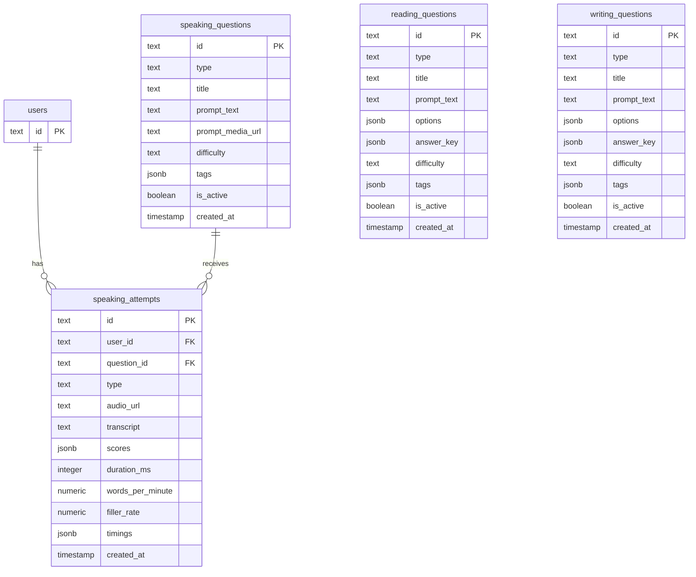

# PTE Speaking System Architecture and Data Model

Source-of-truth document for implementing end-to-end Speaking practice with scalable question tables, recording, Vercel Blob storage, AI scoring, and submission/history. This plan integrates with the existing Next.js App Router, Drizzle ORM, and PTE utilities already present in the codebase.

Key existing references to align with:

- [lib/db/schema.ts](lib/db/schema.ts:1)
- [lib/pte/types.ts](lib/pte/types.ts:1)
- [lib/pte/ai-feedback.ts](lib/pte/ai-feedback.ts:1)
- [lib/pte/pte-scoring.ts](lib/pte/pte-scoring.ts:1)
- [lib/db/practice-sessions.ts](lib/db/practice-sessions.ts:1)
- [app/pte/academic/practice/[section]/[questionType]/page.tsx](app/pte/academic/practice/%5Bsection%5D/%5BquestionType%5D/page.tsx:1)
- [app/academic/pte-practice-test/speaking/read-aloud/page.tsx](app/academic/pte-practice-test/speaking/read-aloud/page.tsx:1)
- [app/academic/pte-practice-test/speaking/read-aloud/question/[id]/page.tsx](app/academic/pte-practice-test/speaking/read-aloud/question/%5Bid%5D/page.tsx:1)
- [app/api/pte-practice/questions/route.ts](app/api/pte-practice/questions/route.ts:1)
- [app/api/pte-practice/seed/route.ts](app/api/pte-practice/seed/route.ts:1)
- [vercel.json](vercel.json:1)

Notes:

- Do not change code in this step. This document defines what will be implemented next.
- Drizzle will target Postgres or SQLite with compatible types; explicit SQL is provided for Postgres with guidance for SQLite.

---

1. Speaking Coverage

Speaking Types in scope:

- Read Aloud
- Repeat Sentence
- Describe Image
- Retell Lecture
- Answer Short Question
- Summarize Group Discussion
- Respond to a Situation

Timers per real PTE module:

- Read Aloud: prep 35s, record 40s
- Repeat Sentence: no prep, record 15s (recording starts after prompt ends)
- Describe Image: prep 25s, record 40s
- Retell Lecture: prep 10s, record 40s
- Answer Short Question: no prep, record 10s
- Summarize Group Discussion: prep 20s, record 60s
- Respond to a Situation: prep 20s, record 40s

Prompt requirements by type:

- Read Aloud
  - Prompt: text required (promptText)
  - promptMediaUrl: optional (usually none)
- Repeat Sentence
  - Prompt: audio required (promptMediaUrl to audio)
  - promptText: optional (if transcript is available)
- Describe Image
  - Prompt: image required (promptMediaUrl to image)
  - promptText: optional (instructions)
- Retell Lecture
  - Prompt: audio required (promptMediaUrl)
  - promptText: optional (notes)
- Answer Short Question
  - Prompt: audio preferred (promptMediaUrl) or text-only promptText acceptable
- Summarize Group Discussion
  - Prompt: audio preferred (promptMediaUrl) or text-only promptText acceptable
- Respond to a Situation
  - Prompt: audio preferred (promptMediaUrl) or text-only promptText acceptable

Implementation detail:

- The question row is authoritative. The UI prompt renderer will use promptText (if present) and/or promptMediaUrl based on type. This keeps one table scalable to all speaking question types.

---

2. Data Model (Drizzle; Postgres-agnostic)

New Tables

- speaking_questions: authoritative source for speaking items
- speaking_attempts: user submissions and scoring results
- reading_questions: minimal schema for compatibility and shared UI
- writing_questions: minimal schema for compatibility and shared UI

Drizzle models (to be added alongside existing [lib/db/schema.ts](lib/db/schema.ts:1) models; migrations described below):

speaking_questions:

- id: cuid (text) primary key
- type: text enum: 'read_aloud' | 'repeat_sentence' | 'describe_image' | 'retell_lecture' | 'answer_short_question' | 'summarize_group_discussion' | 'respond_to_a_situation'
- title: text not null
- promptText: text nullable
- promptMediaUrl: text nullable (audio or image URL)
- difficulty: text enum 'easy' | 'medium' | 'hard' (lowercase to align with [app/api/pte-practice/questions/route.ts](app/api/pte-practice/questions/route.ts:1))
- tags: jsonb array nullable (e.g. ["weekly_prediction","topic_health"])
- isActive: boolean default true not null
- createdAt: timestamp default now not null

Indexes:

- idx_speaking_questions_type (type)
- idx_speaking_questions_is_active (isActive)
- GIN index on tags (where supported; Postgres)

speaking_attempts:

- id: cuid (text) primary key
- userId: text not null references users(id) on delete cascade
- questionId: text not null references speaking_questions(id) on delete cascade
- type: text enum mirror of speaking_questions.type (denormalized for query speed)
- audioUrl: text not null (Vercel Blob URL)
- transcript: text nullable
- scores: jsonb not null default '{}'
  - Suggested JSON structure:
    {
    "content": number, // 0-90
    "pronunciation": number, // 0-90
    "fluency": number, // 0-90
    "total": number, // 0-90
    "rubric": {
    "contentNotes": string,
    "fluencyNotes": string,
    "pronunciationNotes": string,
    "alignmentPercent": number, // when applicable
    "details": Record<string, any>
    }
    }
- durationMs: integer not null
- wordsPerMinute: decimal(6,2) nullable
- fillerRate: decimal(6,3) nullable // e.g., fillers per word or per second
- timings: jsonb not null
  - Suggested:
    {
    "prepMs": number,
    "recordMs": number,
    "startAt": string, // ISO timestamp
    "endAt": string // ISO timestamp
    }
- createdAt: timestamp default now not null

Indexes:

- idx_speaking_attempts_question (questionId)
- idx_speaking_attempts_user_type (userId, type)
- GIN on scores where supported (optional for analytics)

reading_questions (minimal):

- id: cuid (text) pk
- type: text (e.g., 'mcq_single', 'mcq_multiple', 'fib', 'reorder_paragraphs')
- title: text not null
- promptText: text not null
- options: jsonb nullable
- answerKey: jsonb or text nullable
- difficulty: text enum 'easy' | 'medium' | 'hard'
- tags: jsonb array nullable
- isActive: boolean default true not null
- createdAt: timestamp default now not null

writing_questions (minimal):

- id: cuid (text) pk
- type: text (e.g., 'summarize_written_text', 'write_essay')
- title: text not null
- promptText: text not null
- options: jsonb nullable
- answerKey: jsonb or text nullable
- difficulty: text enum 'easy' | 'medium' | 'hard'
- tags: jsonb array nullable
- isActive: boolean default true not null
- createdAt: timestamp default now not null

TypeScript additions in [lib/pte/types.ts](lib/pte/types.ts:1)

- Add enum SpeakingType (values in snake_case to match DB; map to display labels in UI)
  - 'read_aloud' | 'repeat_sentence' | 'describe_image' | 'retell_lecture' | 'answer_short_question' | 'summarize_group_discussion' | 'respond_to_a_situation'
- Add interface SpeakingScore and SpeakingRubric to match scores JSON shape
- Add TimerConfig and SpeakingTimerMap entries per type

Example snippet to be implemented:

```ts
// Extend types file

export enum SpeakingType {
  READ_ALOUD = 'read_aloud',
  REPEAT_SENTENCE = 'repeat_sentence',
  DESCRIBE_IMAGE = 'describe_image',
  RETELL_LECTURE = 'retell_lecture',
  ANSWER_SHORT_QUESTION = 'answer_short_question',
  SUMMARIZE_GROUP_DISCUSSION = 'summarize_group_discussion',
  RESPOND_TO_A_SITUATION = 'respond_to_a_situation',
}

export type SpeakingRubric = {
  contentNotes?: string;
  fluencyNotes?: string;
  pronunciationNotes?: string;
  alignmentPercent?: number;
  details?: Record<string, any>;
};

export type SpeakingScore = {
  content: number;        // 0..90
  pronunciation: number;  // 0..90
  fluency: number;        // 0..90
  total: number;          // 0..90
  rubric?: SpeakingRubric;
};

export type SpeakingTimings = {
  prepMs: number;
  recordMs: number;
  startAt: string; // ISO
  endAt: string;   // ISO
};
```

Migrations plan

- New SQL migration: 0003_speaking_questions_attempts.sql
- Postgres DDL (representative; implement with Drizzle SQL builder or raw SQL):

```sql
-- speaking_questions
create table if not exists speaking_questions (
  id text primary key,
  type text not null,
  title text not null,
  prompt_text text,
  prompt_media_url text,
  difficulty text not null check (difficulty in ('easy','medium','hard')),
  tags jsonb,
  is_active boolean not null default true,
  created_at timestamp not null default now()
);
create index if not exists idx_speaking_questions_type on speaking_questions(type);
create index if not exists idx_speaking_questions_is_active on speaking_questions(is_active);
-- Postgres only:
create index if not exists idx_speaking_questions_tags_gin on speaking_questions using GIN (tags);

-- speaking_attempts
create table if not exists speaking_attempts (
  id text primary key,
  user_id text not null references users(id) on delete cascade,
  question_id text not null references speaking_questions(id) on delete cascade,
  type text not null,
  audio_url text not null,
  transcript text,
  scores jsonb not null default '{}'::jsonb,
  duration_ms integer not null,
  words_per_minute numeric(6,2),
  filler_rate numeric(6,3),
  timings jsonb not null,
  created_at timestamp not null default now()
);
create index if not exists idx_speaking_attempts_question on speaking_attempts(question_id);
create index if not exists idx_speaking_attempts_user_type on speaking_attempts(user_id, type);

-- minimal reading_questions
create table if not exists reading_questions (
  id text primary key,
  type text not null,
  title text not null,
  prompt_text text not null,
  options jsonb,
  answer_key jsonb,
  difficulty text not null check (difficulty in ('easy','medium','hard')),
  tags jsonb,
  is_active boolean not null default true,
  created_at timestamp not null default now()
);

-- minimal writing_questions
create table if not exists writing_questions (
  id text primary key,
  type text not null,
  title text not null,
  prompt_text text not null,
  options jsonb,
  answer_key jsonb,
  difficulty text not null check (difficulty in ('easy','medium','hard')),
  tags jsonb,
  is_active boolean not null default true,
  created_at timestamp not null default now()
);
```

- SQLite notes: use TEXT for json fields and enforce via app-level validation; drop GIN indices; replace now() defaults appropriately.

Additional integration note:

- Existing general-purpose [schema.pteQuestions](lib/db/schema.ts:114) remains for legacy or general practice UI. New speaking tables are focused and tuned for speaking pipeline and storage. The shared question list UI can read from either pteQuestions or speaking_questions via a translation adapter.

---

3. Seeding Strategy

Assets

- Use files under:
  asset/Offline_Practice_Test Pearson Model/Part 1_Speaking and Writing_PTE Academic Offline Practice Test/Prompts & Sample Responses/Prompts/
- Seed audio prompts for:
  - Repeat Sentence: folders under Prompts/1 Repeat Sentence/
  - Retell Lecture: folders under Prompts/2 Retell Lecture/

JSON seed templates

- Read Aloud (text-only):

```json
{
  "type": "read_aloud",
  "title": "Read Aloud — Sample Passage",
  "promptText": "In South Australia, most individuals with COVID-19 experience mild illness ...",
  "promptMediaUrl": null,
  "difficulty": "medium",
  "tags": ["seed", "reading_aloud"]
}
```

- Describe Image (image placeholder):

```json
{
  "type": "describe_image",
  "title": "Describe Image — Line Chart",
  "promptText": "Describe the main trends shown in the image.",
  "promptMediaUrl": "https://example.com/placeholder-image.png",
  "difficulty": "medium",
  "tags": ["seed", "image_description"]
}
```

- Answer Short Question (text-only prompt):

```json
{
  "type": "answer_short_question",
  "title": "ASQ — General Knowledge",
  "promptText": "What do you call a baby cat",
  "promptMediaUrl": null,
  "difficulty": "easy",
  "tags": ["seed", "asq"]
}
```

- Summarize Group Discussion (text prompt):

```json
{
  "type": "summarize_group_discussion",
  "title": "SGD — Team Planning",
  "promptText": "You will hear a group discussing their quarterly plan. Summarize the key points.",
  "promptMediaUrl": null,
  "difficulty": "medium",
  "tags": ["seed", "sgd"]
}
```

- Respond to a Situation (text prompt):

```json
{
  "type": "respond_to_a_situation",
  "title": "Respond — Customer Complaint",
  "promptText": "You are a store manager. A customer complains that their order arrived late. Respond appropriately.",
  "promptMediaUrl": null,
  "difficulty": "medium",
  "tags": ["seed", "situation"]
}
```

Audio prompt seeding for Repeat Sentence and Retell Lecture

- For each discovered mp3 file, create a speaking_questions row with:
  - type: 'repeat_sentence' or 'retell_lecture'
  - title derived from filename or folder
  - promptMediaUrl: app-relative public URL (serve via /asset path or upload to Blob in a pre-seed step)
  - promptText: optional (if transcript is available)
  - tags: include ["seed", "offline_practice_test"]

Seed endpoint

- Extend existing [app/api/pte-practice/seed/route.ts](app/api/pte-practice/seed/route.ts:1) or add a new /api/speaking/seed.
- Contract: POST /api/pte-practice/seed with body:

```json
{
  "resetAndSeed": true,
  "targets": {
    "speaking": [
      "read_aloud",
      "repeat_sentence",
      "describe_image",
      "retell_lecture",
      "answer_short_question",
      "summarize_group_discussion",
      "respond_to_a_situation"
    ],
    "reading": [],
    "writing": []
  }
}
```

Behavior:

- If resetAndSeed is true, truncate speaking_questions and dependent speaking_attempts (respect FK constraints) before seeding.
- Populate as per templates and assets.
- Return summary counts { insertedByType: Record<string, number> }.

---

4. Storage (Vercel Blob)

Client-first direct upload for audio recordings

- Use @vercel/blob direct client upload to minimize server memory usage.
- Path convention:
  pte/speaking/{type}/{questionId}/{attemptId}.webm

Required env:

- VERCEL_BLOB_READ_WRITE_TOKEN (set in .env.local and Vercel Project Settings)

Constraints and validation:

- Filetype: audio/webm, audio/mp4, or audio/ogg (prefer webm with Opus)
- Size limit: 15 MB
- Duration: under 90s (validate client-side and server-side based on timings)

Client outline (to be implemented in unified Recorder component):

```ts
// Pseudocode; to be implemented in UI component

import { put } from '@vercel/blob';

async function uploadAudioWebm(blob: Blob, path: string) {
  // path e.g., `pte/speaking/${type}/${questionId}/${attemptId}.webm`
  const res = await put(path, blob, {
    access: 'public',
    contentType: 'audio/webm',
    token: process.env.NEXT_PUBLIC_VERCEL_BLOB_RW || undefined
  });
  return res.url; // public URL
}
```

Server-side upload fallback

- New API route: [app/api/uploads/audio/route.ts](app/api/uploads/audio/route.ts:1)
- Accepts multipart/form-data or binary body with headers:
  - Content-Type: audio/webm
  - X-Speaking-Type, X-Question-Id, X-Attempt-Id
- Server verifies:
  - Authenticated session (see [lib/auth/session.ts](lib/auth/session.ts:1))
  - Size under 15 MB (check Content-Length)
  - Duration under 90s (use timings from client or optional media probe server-side)
- Uses @vercel/blob on server if direct client upload is disabled or fails.
- Returns { url }

CORS

- Direct uploads to Vercel Blob should be allowed; for fallback server route, default Next.js API CORS is acceptable for same-origin app. If exposing from other origins, set headers accordingly.

---

5. API Contracts (App Router)

All routes under app/api/ will be RSC-compatible handlers.

Speaking Questions

- GET /api/speaking/questions
  - Query: type=read_aloud repeat_sentence ...; page=1; pageSize=20; search=; difficulty=All|easy|medium|hard
  - Response 200:

```json
{
  "data": [
    {
      "id": "cuid1",
      "type": "read_aloud",
      "title": "Read Aloud — Sample 1",
      "promptText": "In South Australia, ...",
      "promptMediaUrl": null,
      "difficulty": "medium",
      "tags": ["seed"],
      "isActive": true,
      "createdAt": "2025-01-01T00:00:00.000Z"
    }
  ],
  "page": 1,
  "pageSize": 20,
  "total": 120
}
```

- GET /api/speaking/questions/[id]
  - Response 200:

```json
{
  "id": "cuid1",
  "type": "read_aloud",
  "title": "Read Aloud — Sample 1",
  "promptText": "In South Australia, ...",
  "promptMediaUrl": null,
  "difficulty": "medium",
  "tags": ["seed"],
  "isActive": true,
  "createdAt": "2025-01-01T00:00:00.000Z",
  "nav": {
    "prevId": "cuid0",
    "nextId": "cuid2"
  }
}
```

Speaking Attempts

- POST /api/speaking/attempts
  - Body:

```json
{
  "questionId": "cuid1",
  "type": "read_aloud",
  "audioUrl": "https://blob.vercel-storage.com/pte/speaking/read_aloud/cuid1/cuidAttempt.webm",
  "durationMs": 38500,
  "timings": {
    "prepMs": 35000,
    "recordMs": 40000,
    "startAt": "2025-01-01T10:00:00.100Z",
    "endAt": "2025-01-01T10:00:38.600Z"
  }
}
```

- Server steps:
  a) Auth required (see Security).
  b) Optionally fetch/process audio metadata (content-type, size).
  c) Transcribe via Transcriber (see Scoring Pipeline).
  d) Score via pte scoring + AI feedback.
  e) Persist speaking_attempts.
  f) Return attempt with scores and feedback.
- Response 201:

```json
{
  "id": "cuidAttempt",
  "userId": "user_123",
  "questionId": "cuid1",
  "type": "read_aloud",
  "audioUrl": "https://blob...",
  "transcript": "In South Australia, most individuals ...",
  "scores": {
    "content": 75,
    "pronunciation": 78,
    "fluency": 72,
    "total": 75,
    "rubric": {
      "contentNotes": "Covered key content.",
      "fluencyNotes": "Some hesitations.",
      "pronunciationNotes": "Some phoneme issues.",
      "alignmentPercent": 93.5,
      "details": {}
    }
  },
  "durationMs": 38500,
  "wordsPerMinute": 138.2,
  "fillerRate": 0.024,
  "timings": {
    "prepMs": 35000,
    "recordMs": 40000,
    "startAt": "2025-01-01T10:00:00.100Z",
    "endAt": "2025-01-01T10:00:38.600Z"
  },
  "createdAt": "2025-01-01T10:00:39.000Z"
}
```

- GET /api/speaking/attempts
  - Query: questionId=... or none (then list current user’s attempts, latest first). Optional page/pageSize.
  - Response 200:

```json
{
  "data": [
    {
      "id": "cuidAttempt",
      "questionId": "cuid1",
      "type": "read_aloud",
      "audioUrl": "https://blob...",
      "scores": { "total": 75 },
      "createdAt": "2025-01-01T10:00:39.000Z"
    }
  ],
  "page": 1,
  "pageSize": 20,
  "total": 12
}
```

Seeding endpoints

- Reuse and extend [app/api/pte-practice/seed/route.ts](app/api/pte-practice/seed/route.ts:1) with POST body to accept resetAndSeed flag, as specified in Seeding Strategy.
- Optionally add /api/speaking/seed with identical contract, implemented as a thin wrapper.

---

6. Scoring Pipeline

Dependencies:

- Use scoring utilities from:
  - [lib/pte/pte-scoring.ts](lib/pte/pte-scoring.ts:1)
  - [lib/pte/ai-feedback.ts](lib/pte/ai-feedback.ts:1)

Interfaces

Transcriber interface:

```ts
export interface Transcriber {
  transcribe: (audioUrl: string) => Promise<{
    transcript: string;
    words: Array<{ token: string; start?: number; end?: number }>;
    language?: string;
    confidence?: number;
  }>;
}
```

Default transcriber: OpenAI Whisper (server-side)

- Enabled if OPENAI_API_KEY present and AI_TRANSCRIBE_PROVIDER=openai
- Implementation outline:
  - Download audio in the API route (or stream to OpenAI if supported).
  - Use whisper-1 or newer.
  - Return transcript and optional word timings.

Fallback modes:

- basic-web-speech (client provides transcript via Web Speech API; dev only)
- none (skip transcription; transcript remains null)

Env flags:

- AI_TRANSCRIBE_PROVIDER=openai|none (default none if not set)
- OPENAI_API_KEY=...

Calculations:

- wordsPerMinute: words / (durationMs / 60000)
- fillerRate:
  - Compute fillers such as ["um","uh","er","ah","like","you know","sort of","kind of"] occurrences / total words
- hesitation detection:
  - If word timings available: count gaps >= 800ms as hesitation points; reflect in fluency deduction
  - If timings unavailable: approximate from fillerRate only
- alignment vs prompt (when applicable):
  - For Read Aloud: Levenshtein similarity between transcript and question.promptText
  - For Repeat Sentence: requires ground-truth transcript (not always available in assets). If absent, skip alignment or seed an optional transcript in future.

Score composition:

- content, pronunciation, fluency each 0..90
- total: weighted average (e.g., 0.4 content, 0.3 pronunciation, 0.3 fluency) — calibrate later
- Use [aiFeedback.generateAIFeedback()](lib/pte/ai-feedback.ts:1) for narrative feedback; use [pteScoring.calculatePTEScore](lib/pte/pte-scoring.ts:224) to optionally normalize modules.
- Provide a convenience wrapper pteScoring.scoreSpeaking(...) to house the rules above and return SpeakingScore; to be added in [lib/pte/pte-scoring.ts](lib/pte/pte-scoring.ts:1).

Persist:

- Save transcript, scores JSON, timing metrics to speaking_attempts
- Return the saved attempt in POST response

---

7. UI/UX and Routing

Question List (speaking)

- Route: /pte/academic/practice/speaking/[questionType]
- Backed by reusable QuestionsTable; see [components/pte/questions-table.tsx](components/pte/questions-table.tsx:1)
- Current list page implementation: [app/pte/academic/practice/[section]/[questionType]/page.tsx](app/pte/academic/practice/%5Bsection%5D/%5BquestionType%5D/page.tsx:1)
  - This currently consumes [app/api/pte-practice/questions/route.ts](app/api/pte-practice/questions/route.ts:1) reading from pteQuestions.
  - For speaking, we will add a data adapter endpoint /api/speaking/questions to read from speaking_questions with same shape expected by QuestionsTable.

Question Detail (speaking)

- Route: /academic/pte-practice-test/speaking/[questionType]/question/[id]
  - Mirrors existing read-aloud alias pages:
    - [app/academic/pte-practice-test/speaking/read-aloud/page.tsx](app/academic/pte-practice-test/speaking/read-aloud/page.tsx:1)
    - [app/academic/pte-practice-test/speaking/read-aloud/question/[id]/page.tsx](app/academic/pte-practice-test/speaking/read-aloud/question/%5Bid%5D/page.tsx:1)
- Components:
  - Prompt renderer: text (promptText), audio player (promptMediaUrl audio), image (promptMediaUrl image)
  - Unified Recorder component: shows prep and record timers, waveform, redo, upload, and submit
  - After submit: show Score Details modal (pronunciation, fluency, content, total; rubric notes)
  - Attempts history: list current user attempts with small audio players and compact scores

Recorder component (props shape):

```ts
type RecorderProps = {
  type: SpeakingType;
  questionId: string;
  prepMs: number;
  recordMs: number;
  autoStartAfterPrompt?: boolean; // true for RS after audio ends
  onUploaded?: (audioUrl: string) => void;
  onSubmit?: (attempt: any) => void;
};
```

Timer configuration per SpeakingType:

```ts
export const SPEAKING_TIMERS: Record<SpeakingType, { prepMs: number; recordMs: number; autoStartAfterPrompt?: boolean }> = {
  read_aloud: { prepMs: 35000, recordMs: 40000 },
  repeat_sentence: { prepMs: 0, recordMs: 15000, autoStartAfterPrompt: true },
  describe_image: { prepMs: 25000, recordMs: 40000 },
  retell_lecture: { prepMs: 10000, recordMs: 40000 },
  answer_short_question: { prepMs: 0, recordMs: 10000, autoStartAfterPrompt: true },
  summarize_group_discussion: { prepMs: 20000, recordMs: 60000 },
  respond_to_a_situation: { prepMs: 20000, recordMs: 40000 }
};
```

Accessibility and error states:

- Microphone permission prompts, status indicators
- Clear error banners for upload failure or auth required
- Keyboard accessible controls; visible focus; ARIA labels for timers and controls
- Retry UI for transient upload errors; allow redo before submit

---

8. Security and Auth

Auth requirement:

- All speaking attempt submissions require authenticated user
- Use session utilities from [lib/auth/session.ts](lib/auth/session.ts:1) or existing auth provider; the API route should 401 if no session

Rate Limit:

- Max 60 attempt submissions per user per hour
- Strategy options:
  - KV-based counter (Upstash Redis or Vercel KV): key rl:speaking_attempts:{userId}:{hour}
  - DB counter table with TTL emulation via createdAt window
- If infra not present, record a TODO and temporarily enforce a soft limit with DB count over last hour

Data validation and integrity:

- Verify user owns the attempt; restrict reads to current user unless admin
- Verify question exists and is active
- Verify type matches question.type

---

9. Non-functional

Observability:

- Server logs with structured entries around upload, transcribe, score, persist steps (include correlationId/attemptId)
- Client toasts for success/failure states
- Retry semantics:
  - Upload retry: 2 times on network errors
  - POST attempts retry: none; show actionable error and allow resubmission

Performance:

- Stream uploads to Blob; avoid base64 encoding of audio
- Use Blob URLs locally to preview recordings
- Paginate lists; use lean selects and indexes
- Avoid fetching and re-encoding audio server-side unless required by the transcriber

i18n/timezone:

- Store timestamps in ISO UTC on server
- Render using user’s locale/time zone on client

---

10. Deployment and Configuration

Environment variables (example .env.local):

```
# Auth
AUTH_SECRET=...

# OpenAI (optional for transcription/scoring feedback)
OPENAI_API_KEY=...

# Transcription provider
AI_TRANSCRIBE_PROVIDER=openai

# Vercel Blob
VERCEL_BLOB_READ_WRITE_TOKEN=...

# App
NEXT_PUBLIC_VERCEL_BLOB_RW=...
```

vercel.json adjustments:

- Existing limits in [vercel.json](vercel.json:1) are OK for most API routes
- If transcribe/scoring route needs more time, consider:

```
{
  "functions": {
    "app/api/speaking/attempts/route.ts": {
      "memory": 1024,
      "maxDuration": 60
    }
  }
}
```

- If audio upload fallback route should be Edge-distributed, keep size/time constraints in mind; standard Node runtime is recommended for multipart handling.

Local dev instructions:

- Set .env.local with Blob token (dev token from Vercel)
- pnpm install; pnpm dev
- Seed speaking questions:
  - POST /api/pte-practice/seed with { "resetAndSeed": true, "targets": { "speaking": ["read_aloud","repeat_sentence","describe_image","retell_lecture","answer_short_question","summarize_group_discussion","respond_to_a_situation"] } }
- Navigate to:
  - /pte/academic/practice/speaking/read-aloud
  - /academic/pte-practice-test/speaking/read-aloud/question/<id>

---

ERD Diagram (Mermaid)



---

Endpoint Summary

Speaking Questions

- [GET] /api/speaking/questions
  - Returns paginated list; filters: type, page, pageSize, search, difficulty
- [GET] /api/speaking/questions/[id]
  - Returns question plus adjacent navigation ids (prevId/nextId)

Speaking Attempts

- [POST] /api/speaking/attempts
  - Body: { questionId, type, audioUrl, durationMs, timings }
  - Returns: persisted attempt with transcript, scores, rubric
- [GET] /api/speaking/attempts
  - Query: questionId=... or none (current user)
  - Returns: list of attempts, latest first

Seeding

- [POST] /api/pte-practice/seed (extended)
  - Body: { resetAndSeed: boolean, targets: { speaking: SpeakingType[] } }
- Optional alias:
  - [POST] /api/speaking/seed

---

Implementation References and Contracts

- API implementation files to add:
  - [api GET /api/speaking/questions handler](app/api/speaking/questions/route.ts:1)
  - [api GET /api/speaking/questions/[id] handler](app/api/speaking/questions/%5Bid%5D/route.ts:1)
  - [api POST/GET /api/speaking/attempts handler](app/api/speaking/attempts/route.ts:1)
  - [api POST /api/uploads/audio fallback](app/api/uploads/audio/route.ts:1)

- Scoring integration points:
  - [pteScoring.calculatePTEScore](lib/pte/pte-scoring.ts:224)
  - [aiFeedback.generateAIFeedback](lib/pte/ai-feedback.ts:1)
  - New helper to add: pteScoring.scoreSpeaking (wrapper) in [lib/pte/pte-scoring.ts](lib/pte/pte-scoring.ts:1)

- Auth:
  - [lib/auth/session.ts](lib/auth/session.ts:1)

- Existing question list page referencing pteQuestions:
  - [app/pte/academic/practice/[section]/[questionType]/page.tsx](app/pte/academic/practice/%5Bsection%5D/%5BquestionType%5D/page.tsx:1)
  - For speaking, provide a compatible payload shape from /api/speaking/questions.

---

Validation Checklist for Code Mode

- Schema
  - Create migration 0003_speaking_questions_attempts.sql with tables and indices.
  - Add Drizzle models for speaking_questions, speaking_attempts, reading_questions, writing_questions.

- Types
  - Extend [lib/pte/types.ts](lib/pte/types.ts:1) with SpeakingType, SpeakingScore, SpeakingTimings, timer map.

- Seed
  - Extend [app/api/pte-practice/seed/route.ts](app/api/pte-practice/seed/route.ts:1) to handle resetAndSeed and populate speaking_questions using assets and JSON templates.

- Storage
  - Implement client direct upload to Vercel Blob; add fallback [app/api/uploads/audio/route.ts](app/api/uploads/audio/route.ts:1).

- API
  - Implement /api/speaking/questions and /api/speaking/questions/[id] reading from speaking_questions.
  - Implement /api/speaking/attempts POST (transcribe, score, persist) and GET (list attempts).

- Scoring
  - Add pteScoring.scoreSpeaking wrapper; integrate [aiFeedback.generateAIFeedback](lib/pte/ai-feedback.ts:1).
  - Implement Transcriber with OpenAI Whisper when enabled; provide 'none' fallback controlled by AI_TRANSCRIBE_PROVIDER.

- UI
  - Add unified Recorder component with timers map and error handling.
  - Update speaking question detail pages to use new API and Recorder.
  - Display attempts history and Score Details modal.

- Security
  - Enforce auth and rate limit (60/hour/user) on attempt submissions.

- Observability & Perf
  - Add structured logs around upload/transcribe/score.
  - Stream uploads; avoid base64; paginate queries.

---

Appendix: Timer and Prompt Matrix

- read_aloud: prep 35s, record 40s; promptText required; promptMediaUrl optional
- repeat_sentence: no prep, record 15s (auto start after audio ends); promptMediaUrl audio required
- describe_image: prep 25s, record 40s; promptMediaUrl image required
- retell_lecture: prep 10s, record 40s; promptMediaUrl audio required
- answer_short_question: no prep, record 10s; audio prompt preferred; text prompt acceptable
- summarize_group_discussion: prep 20s, record 60s; audio prompt preferred; text prompt acceptable
- respond_to_a_situation: prep 20s, record 40s; audio prompt preferred; text prompt acceptable
