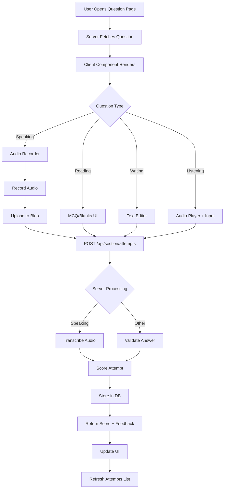

# Speaking Implementation Pattern Analysis

## Executive Summary

This document provides a comprehensive technical analysis of the PTE Academic Speaking section implementation, identifying reusable patterns for implementing Reading, Writing, and Listening sections.

## 1. Database Schema Pattern

### Speaking-Specific Tables

**speakingQuestions Table** (schema.ts:382-396)

```typescript
{
  id: uuid (PK)
  type: speakingTypeEnum (7 types: read_aloud, repeat_sentence, etc.)
  title: text
  promptText: text (nullable)
  promptMediaUrl: text (nullable)
  difficulty: difficultyEnum ('Easy' | 'Medium' | 'Hard')
  tags: jsonb (default: [])
  isActive: boolean (default: true)
  createdAt: timestamp

  // Indexes
  idx_speaking_questions_type (type)
  idx_speaking_questions_is_active (isActive)
  idx_speaking_questions_tags_gin (tags using GIN)
}
```

**speakingAttempts Table** (schema.ts:398-414)

```typescript
{
  id: uuid (PK)
  userId: text (FK → users.id, CASCADE)
  questionId: uuid (FK → speakingQuestions.id, CASCADE)
  type: speakingTypeEnum
  audioUrl: text
  transcript: text (nullable)
  scores: jsonb (content, pronunciation, fluency, total, rubric, feedback, meta)
  durationMs: integer
  wordsPerMinute: decimal(6,2)
  fillerRate: decimal(6,3)
  timings: jsonb (prepMs, recordMs, startAt, endAt)
  createdAt: timestamp

  // Indexes
  idx_speaking_attempts_question (questionId)
  idx_speaking_attempts_user_type (userId, type)
}
```

### Key Pattern Observations

1. **Dedicated Tables**: Speaking uses separate `speakingQuestions` and `speakingAttempts` tables rather than generic `pteQuestions`/`testAttempts`
2. **Type Safety**: PostgreSQL enums enforce valid question types at DB level
3. **JSONB Flexibility**: Used for scores, tags, and timings allowing schema evolution without migrations
4. **Proper Indexing**: Type-based and composite indexes for common query patterns
5. **Foreign Key Cascades**: DELETE CASCADE ensures data consistency
6. **Nullable Fields**: Optional content (promptText, promptMediaUrl, transcript) allows flexibility

### Pattern for Other Sections

**Already Defined** (schema.ts:416-446):

- `readingQuestions` table (similar structure, has options and answerKey)
- `writingQuestions` table (similar structure, has options and answerKey)
- Missing: `listeningQuestions` table (needs to be created)

## 2. API Routes Structure

### Questions Endpoints

**GET /api/speaking/questions/route.ts**

```typescript
// Features:
- Pagination (page, pageSize with defaults)
- Filtering (type, difficulty, isActive, search)
- Zod schema validation
- Case-insensitive search (ILIKE)
- Ordered by createdAt DESC, id DESC
- Cache-Control headers (s-maxage=60, stale-while-revalidate=600)
- Error handling with status codes
```

**Query Parameters**:

```typescript
{
  type: SpeakingType (required)
  page: number (default: 1, min: 1)
  pageSize: number (default: 20, min: 1, max: 100)
  search: string (optional, default: '')
  difficulty: 'All' | 'Easy' | 'Medium' | 'Hard' (default: 'All')
  isActive: boolean (default: true)
}
```

**Response Format**:

```typescript
{
  page: number
  pageSize: number
  total: number
  items: SpeakingQuestion[]
}
```

**GET /api/speaking/questions/[id]/route.ts**

```typescript
// Features:
- Fetches single question by ID
- Calculates prev/next IDs within same type
- Ordered navigation (createdAt, id)
- 404 handling
- Cache headers
```

**Response Format**:

```typescript
{
  question: SpeakingQuestion
  prevId: string | null
  nextId: string | null
}
```

### Attempts Endpoints

**POST /api/speaking/attempts/route.ts**

```typescript
// Features:
- Authentication required (401 if missing)
- Rate limiting (60 attempts/hour per user, DB-based)
- Content-type validation (application/json)
- Question validation (exists, type match, isActive)
- Audio transcription (with fallback on error)
- AI scoring (content, pronunciation, fluency)
- Metrics calculation (WPM, filler rate)
- JSONB storage for flexible scoring data
```

**Request Body**:

```typescript
{
  questionId: string
  type: SpeakingType
  audioUrl: string (http/https URL, validated)
  durationMs: number (positive, max: 120000)
  timings?: {
    prepMs?: number
    recordMs: number
    startAt?: string
    endAt?: string
  }
}
```

**Response**:

```typescript
{
  attempt: SpeakingAttempt
  feedback?: AIFeedback
}
```

**GET /api/speaking/attempts/route.ts**

```typescript
// Features:
- Authentication required
- Optional questionId filter
- Pagination support
- Returns user's attempts only
```

### Zod Validation Schemas

**Location**: `app/api/speaking/schemas.ts`

Key schemas:

- `SpeakingTypeSchema`: Enum of 7 types
- `DifficultyFilterSchema`: Enum with 'All' default
- `SpeakingListQuerySchema`: Query parameters with coercion
- `SpeakingIdParamsSchema`: Path parameter validation
- `SpeakingTimingsSchema`: Timing data structure
- `SpeakingAttemptBodySchema`: Request body with refinements

**Pattern**: All use Zod for runtime validation + TypeScript inference

## 3. Seed Data Structure

**File Pattern**: `lib/db/seeds/speaking.{type}.json`

Examples:

- `speaking.read_aloud.json`
- `speaking.answer_short_question.json`
- `speaking.repeat_sentence.json` (etc.)

**JSON Structure**:

```json
[
  {
    "title": "Read Aloud — Health Advisory 1",
    "type": "read_aloud",
    "promptText": "In South Australia, most individuals...",
    "promptMediaUrl": null,
    "difficulty": "Medium",
    "tags": ["seed", "read_aloud", "health"]
  }
]
```

**Required Fields**:

- `title`: Descriptive title
- `type`: Must match enum value
- `difficulty`: 'Easy' | 'Medium' | 'Hard'
- `tags`: Array of strings

**Optional Fields**:

- `promptText`: Text prompt (for read_aloud)
- `promptMediaUrl`: URL to media file (for audio/image prompts)

**Key Patterns**:

1. Array of question objects
2. No IDs (auto-generated on insert)
3. Tags for categorization/filtering
4. Type-specific field requirements
5. Null for unused optional fields

## 4. UI Component Architecture

### Component Hierarchy

```
SpeakingQuestionClient (Client Component)
├── QuestionPrompt (Displays question content)
├── SpeakingRecorder (Recording interface)
├── AttemptsList (History of attempts)
└── ScoreDetailsDialog (Score breakdown modal)
```

### SpeakingQuestionClient.tsx

**Purpose**: Main orchestrator for question practice flow

**State Management**:

```typescript
// Question data
[loading, setLoading] - API fetch state
[fetchError, setFetchError] - Error messages
[payload, setPayload] - Question + navigation

// Recording state
[recorded, setRecorded] - Blob + timing data
[submitError, setSubmitError] - Submission errors
[submitting, setSubmitting] - Submit in progress

// UI state
[dialogOpen, setDialogOpen] - Score dialog
[lastAttempt, setLastAttempt] - Latest submission
[attemptsKey, setAttemptsKey] - List refresh trigger
[recorderKey, setRecorderKey] - Recorder remount trigger
```

**Key Features**:

1. **Fetch & Cache**: Loads question data on mount/change
2. **Recording Flow**: Captures blob from recorder component
3. **Upload Flow**: Client-side size check → Upload to Blob → POST attempt
4. **Error Handling**: Specific messages for auth, size, network issues
5. **Reset Mechanism**: Remounts recorder via key change for full reset
6. **Attempt Refresh**: Triggers list reload after submission

**Data Flow**:

```
1. Fetch question from API
2. User records audio → onRecorded callback
3. Click Submit → uploadAudioWithFallback()
4. POST to /api/speaking/attempts
5. Show score dialog
6. Refresh attempts list
```

### SpeakingRecorder.tsx

**Purpose**: Audio recording widget with timers

**Key Features**:

1. **MediaRecorder API**: WebM/Opus format, 128kbps
2. **State Machine**: idle → prepping → recording → finished/error
3. **Timers**:
   - Preparation countdown (optional, e.g., 35s)
   - Recording countdown (required, e.g., 40s)
   - Auto-stop at time limit
4. **Progress Bars**: Visual feedback for both timers
5. **Browser Support**: Detects MediaRecorder availability
6. **Permission Handling**: Graceful denied state
7. **Size Guard**: 15MB limit checked client-side
8. **Cleanup**: Proper stream/interval cleanup on unmount

**State Type**:

```typescript
'idle' | 'prepping' | 'recording' | 'finished' |
'denied' | 'unsupported' | 'error'
```

**Config**: Type-specific timers from `SPEAKING_TIMER_MAP`

### AttemptsList.tsx

**Purpose**: Display user's attempt history

**Features**:

1. **Authentication Aware**: Shows login prompt if 401
2. **Audio Playback**: Native HTML5 audio controls
3. **Score Badges**: Visual score display (content, pronunciation, fluency, total)
4. **Timestamp**: Formatted date/time
5. **Manual Refresh**: Button to reload attempts
6. **Empty State**: Friendly "no attempts yet" message

**Data Flow**:

```
GET /api/speaking/attempts?questionId={id}&page=1&pageSize=25
→ Display sorted by createdAt DESC
```

### Page Structure

**app/pte/academic/practice/speaking/read-aloud/page.tsx**

**Pattern**:

1. Server component for question list
2. Fetches from API (using headers() for absolute URL)
3. Tabs for filtering (All, Weekly, Monthly predictions)
4. Table with: ID, Title, Difficulty, Practiced, Stats
5. Links to individual question pages

**app/pte/academic/practice/speaking/read-aloud/question/[id]/page.tsx**

**Pattern**:

1. Server component fetches question + adjacency
2. Breadcrumb navigation
3. Client component for practice interface
4. Prev/Next navigation buttons
5. Redo functionality via page reload

## 5. Key Patterns & Conventions

### 1. Type Safety

- PostgreSQL enums for question types
- Zod schemas for API validation
- TypeScript types inferred from Drizzle schemas
- Const assertions for literal types

### 2. Error Handling

```typescript
// Consistent error response format
{
  error: string
  code?: string  // e.g., 'NOT_FOUND', 'RATE_LIMITED'
}

// HTTP status codes
400 - Validation errors
401 - Authentication required
404 - Resource not found
415 - Wrong content type
429 - Rate limit exceeded
500 - Internal server error
```

### 3. Authentication Pattern

```typescript
const session = await getSession()
if (!session?.user?.id) {
  return error(401, 'Unauthorized', 'UNAUTHORIZED')
}
```

### 4. Rate Limiting

```typescript
// DB-based: Count attempts in last hour
SELECT COUNT(*) FROM speaking_attempts
WHERE user_id = ?
  AND created_at > NOW() - INTERVAL '1 hour'

// Soft limit: 60 per hour
```

### 5. Pagination

```typescript
// Consistent parameters
page: number (1-based, default: 1)
pageSize: number (default: 20, max: 100)
offset: (page - 1) * pageSize

// Response includes total
{ page, pageSize, total, items }
```

### 6. Upload Flow

```typescript
// Client-side
1. Record audio as Blob
2. Wrap as File with correct MIME
3. Upload via uploadAudioWithFallback()
4. Get back blobUrl
5. POST attempt with blobUrl

// Server-side
1. Receive blobUrl
2. Download for transcription
3. Transcribe with fallback
4. Score the attempt
5. Store all metadata
```

### 7. Caching Strategy

```typescript
// Questions: Cache 60s, stale-while-revalidate 600s
res.headers.set(
  'Cache-Control',
  'public, s-maxage=60, stale-while-revalidate=600'
)

// Attempts: No cache (no-store)
fetch(url, { cache: 'no-store' })
```

## 6. Speaking-Specific Logic

### Requirements Unique to Speaking:

1. **Audio Recording**:
   - MediaRecorder API
   - Browser compatibility checks
   - Microphone permissions
   - Real-time recording progress

2. **Preparation Timers**:
   - Question-type specific prep times
   - Visual countdown
   - Auto-transition to recording

3. **Transcription Service**:
   - Async audio-to-text
   - Provider abstraction
   - Error fallback (continue with empty transcript)

4. **Speaking-Specific Scoring**:
   - Content accuracy
   - Pronunciation quality
   - Fluency/pace
   - Words per minute
   - Filler word rate

5. **Audio Storage**:
   - Large file uploads (up to 15MB)
   - Blob storage URLs
   - Playback in attempts list

### Scoring Flow

```typescript
1. Transcribe audio → transcript
2. Score with scoreAttempt():
   - type: question type
   - question: prompt data
   - transcript: text content
   - audioUrl: for possible future analysis
   - durationMs: timing
3. Calculate metrics:
   - Words per minute
   - Filler rate
4. Store in JSONB:
   {
     content: number,
     pronunciation: number,
     fluency: number,
     total: number,
     rubric: object,
     feedback: string,
     meta: {
       transcriberProvider,
       wordsPerMinute,
       fillerRate,
       transcriptionError?
     }
   }
```

## 7. Recommendations for Reading/Writing/Listening

### Common Patterns to Reuse

✅ **Database Structure**:

- Dedicated `{section}Questions` and `{section}Attempts` tables
- JSONB for flexible data (scores, options, answers)
- Same indexing strategy (type, isActive, userId+type)
- Foreign key cascades

✅ **API Routes**:

- Same endpoint structure: `/api/{section}/questions`, `/api/{section}/questions/[id]`, `/api/{section}/attempts`
- Same query parameters for filtering/pagination
- Same Zod validation pattern
- Same error response format

✅ **Seed Data**:

- Same JSON structure with type-specific fields
- Tags for categorization
- Difficulty levels

✅ **UI Components**:

- Question client orchestrator component
- Attempts list component
- Score details dialog
- Page structure (list → individual question)

### Section-Specific Adaptations

#### Reading Section

**Question Types**:

- Multiple choice (single/multiple)
- Fill in the blanks
- Re-order paragraphs
- Reading & Writing blanks

**Unique Requirements**:

- Text passage storage (long content)
- Options arrays
- Answer keys (for MCQ)
- Paragraph order tracking
- Blank position markers

**Schema Additions**:

```typescript
readingQuestions {
  // Already defined
  options: jsonb // ['A', 'B', 'C', 'D']
  answerKey: jsonb // 'B' or ['A', 'C'] or {blank1: 'word'}
}

readingAttempts {
  selectedOptions?: jsonb
  reorderedParagraphs?: jsonb
  filledBlanks?: jsonb
  // No audio/transcription
}
```

**Scoring**:

- Exact match for MCQ
- Algorithm for paragraph order
- Word matching for blanks

#### Writing Section

**Question Types**:

- Summarize written text
- Write essay

**Unique Requirements**:

- Text input (essay/summary)
- Word count requirements
- Grammar/spelling checking
- AI feedback on structure/coherence

**Schema Additions**:

```typescript
writingQuestions {
  // Already defined
  promptText: text
  wordCountMin: integer
  wordCountMax: integer
}

writingAttempts {
  essayText: text
  wordCount: integer
  // AI scoring for grammar, vocabulary, coherence
  scores: jsonb {
    grammar: number,
    vocabulary: number,
    spelling: number,
    coherence: number,
    taskResponse: number
  }
}
```

**Scoring**:

- Word count validation
- AI-based grammar/spelling
- Coherence analysis
- Task fulfillment

#### Listening Section

**Question Types**:

- Summarize spoken text
- Multiple choice
- Fill in the blanks
- Highlight correct summary
- Select missing word
- Highlight incorrect words
- Write from dictation

**Unique Requirements**:

- Audio prompts (required)
- Transcript for reference
- Audio playback controls
- Timing constraints

**Schema**:

```typescript
listeningQuestions {
  id: uuid
  type: listeningTypeEnum
  title: text
  audioUrl: text (required!)
  transcript: text
  options?: jsonb
  answerKey?: jsonb
  difficulty: difficultyEnum
  tags: jsonb
  isActive: boolean
  createdAt: timestamp
}

listeningAttempts {
  id: uuid
  userId: text
  questionId: uuid
  type: listeningTypeEnum
  textAnswer?: text // for dictation/summary
  selectedOption?: text
  filledBlanks?: jsonb
  scores: jsonb
  createdAt: timestamp
}
```

**Scoring**:

- Similar to reading for MCQ/blanks
- Text matching for dictation
- AI scoring for summary

### Implementation Priority

1. **Reading** (Easiest):
   - Table already exists
   - No audio upload/transcription
   - Simpler UI (text + options)
   - Clear scoring rules

2. **Writing** (Medium):
   - Table already exists
   - Text input component needed
   - AI scoring similar to speaking
   - Word count validation

3. **Listening** (Harder):
   - New table needed
   - Audio playback UI
   - Mix of MCQ and text input
   - Timing coordination

### Migration Checklist

For each section, implement in order:

1. **Database**:
   - [ ] Review/update table schema
   - [ ] Create migration if needed
   - [ ] Add relations
   - [ ] Create seed data

2. **API**:
   - [ ] Create Zod schemas in `/api/{section}/schemas.ts`
   - [ ] Implement `GET /api/{section}/questions`
   - [ ] Implement `GET /api/{section}/questions/[id]`
   - [ ] Implement `POST /api/{section}/attempts`
   - [ ] Implement `GET /api/{section}/attempts`
   - [ ] Add query functions to `lib/pte/queries.ts`

3. **Scoring**:
   - [ ] Create scoring function in `lib/pte/{section}-score.ts`
   - [ ] Define rubric/criteria
   - [ ] Implement feedback generation

4. **UI Components**:
   - [ ] Create `components/pte/{section}/QuestionClient.tsx`
   - [ ] Create input component (MCQ/TextArea/Blanks/etc.)
   - [ ] Create `components/pte/{section}/AttemptsList.tsx`
   - [ ] Create score details dialog

5. **Pages**:
   - [ ] Create list page `/app/pte/academic/practice/{section}/{type}/page.tsx`
   - [ ] Create question page `/app/pte/academic/practice/{section}/{type}/question/[id]/page.tsx`

6. **Testing**:
   - [ ] Test API endpoints
   - [ ] Test UI flow
   - [ ] Test scoring accuracy
   - [ ] Test error cases

## 8. Data Flow Diagram



## Conclusion

The Speaking implementation provides a robust, scalable pattern that can be adapted for Reading, Writing, and Listening sections. Key strengths include:

- Strong type safety (DB enums + Zod)
- Clean separation of concerns
- Flexible JSONB storage
- Consistent API patterns
- Reusable component architecture
- Comprehensive error handling

The main adaptations needed are:

- Section-specific input components
- Different scoring algorithms
- Audio playback for listening
- Text input for writing
- The listening table needs to be created

All architectural patterns, API structures, and database designs can be directly reused with minimal modifications.
